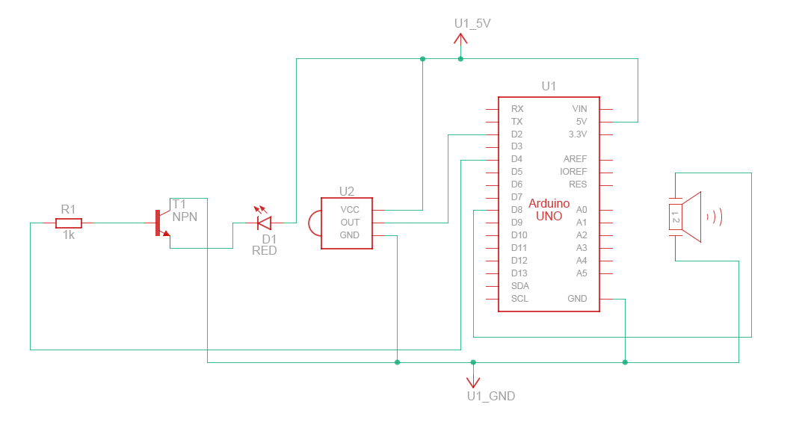

# Description
The circuit is designed to be placed into a chest lid. When the lid is closed, there is an obstruction in the IR sensor (optical gate). When the chest lid is opened, the IR sensor light path is cleared and the buzzer is triggered. After small delay the lights are turned on. The buzzer emmits a melody only once upon chest opening. Lights stay on until the lid is closed. 

# Components

- passive buzzer
- IR sensor (optical gate)
- NPN transistor
- 1kR resistor
- LED lights
- Arduino UNO

# Electrical Schematic
